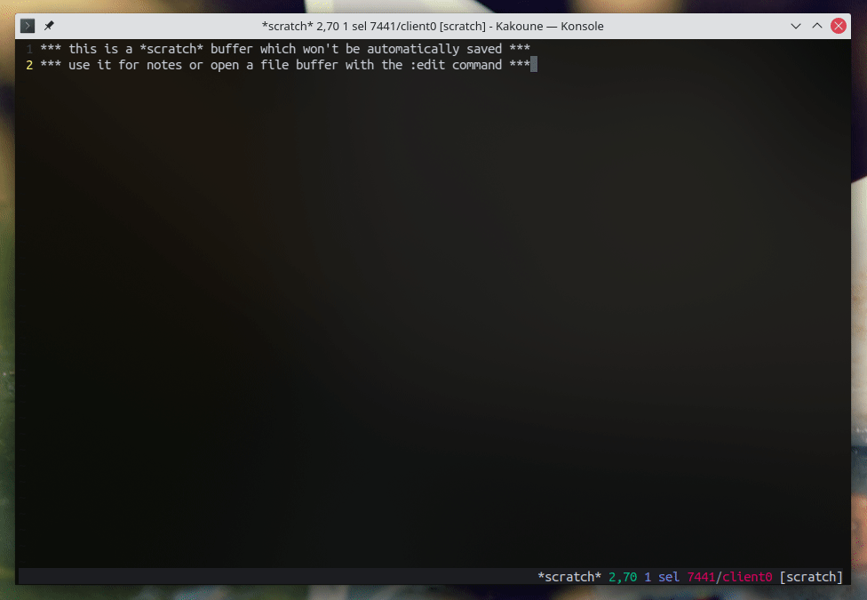
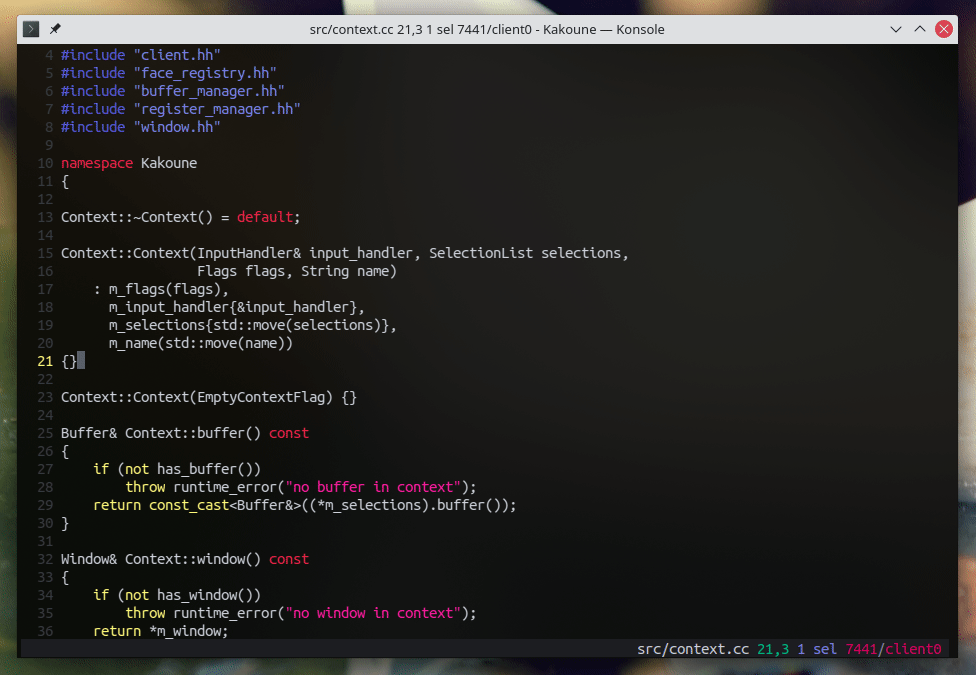
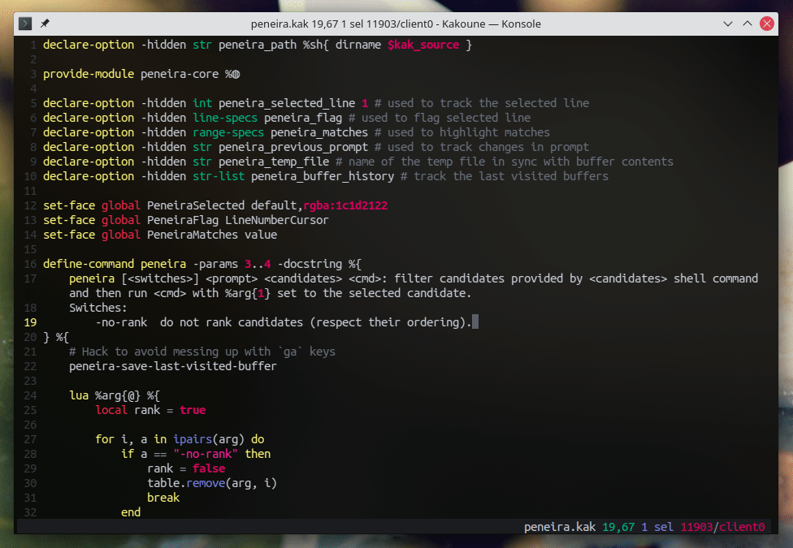

# Peneira

Peneira is a fuzzy finder for Kakoune. You can use it to write custom filters
for candidates lists. You can also use its built-in filters, that allow you to
select files in a directory, symbols in the current document, an so on.



It depends on the [luar](https://github.com/gustavo-hms/luar) plugin. So make
sure you have it installed first.

## Writting your own filter

You can use the `peneira` command to write a filter for yourself. For instance,
here is a simple `buffers` filter to go to a buffer in the buffer list:

```kak
peneira 'buffers: ' %{ printf '%s\n' $kak_quoted_buflist } %{
    buffer %arg{1}
}
```

The `peneira` command expects 3 arguments:

* a text to show in the prompt;
* a shell command that, when executed, will generate a list of candidates (one
  per line);
* a block of Kakoune commands to execute after the user has selected a line.

Inside the commands block, the `%arg{1}` expansion refers to the selected line.

By default, `peneira` ranks the candidates according to an internal score,
showing first the results it thinks the user intended. If you want it respects
the candidates order instead, you can pass the `-no-rank` switch:

```kak
peneira -no-rank 'buffers: ' %{ printf '%s\n' $kak_quoted_buflist } %{
    buffer %arg{1}
}
```

## Built-in filters

Peneira also comes with predefined filters you can use at will.

### peneira-symbols

The `peneira-symbols` filter lists the symbols defined in the current file. You
can use it to quickly navigate in your code structure. It requires [Universal
Ctags](https://ctags.io) compiled with JSON support.



### peneira-lines

The `peneira-lines` filter lists lines in the current file. Use it to quickly go
to a specific line in your document.



### peneira-files

The `peneira-files` filter lists files in the current directory, recursively. It
ignores already opened files, removing them from the candidates list.

If you do want to have even already opened files in the candidates list, you can
easily implement your own filter:

```kak
peneira 'files: ' %{ find . } %{
    edit %arg{1}
}
```

By default, `peneira-files` uses [fd](https://github.com/sharkdp/fd) to get the list of files. You can change
that by editing `peneira_files_command` option, e.g.:

```kak
set-option global peneira_files_command "find ."
```

Or even

```kak
set-option global peneira_files_command "rg --files"
```

### peneira-local-files

The `peneira-local-files` filter works like `peneira-files`, except that it uses
the directory of the currently edited file as the root directory.

## Installation

Remember Peneira requires Luar, so you must also install it. If you use
[plug.kak](https://github.com/andreyorst/plug.kak):

```kak
plug "gustavo-hms/luar" %{
    plug "gustavo-hms/peneira" %{
        require-module peneira
    }
}
```

Note that you need to require the `peneira` module for its commands to be
available.

## Performance tips

Peneira is fast. It should perform well in most cases. However, since everything
happens synchronously, you may experience performance issues on large candidates
list. If that's the case, try configuring Luar to use `luajit` instead:

```kak
set-option global luar_interpreter luajit
```

## Customization

Peneira follows your colorscheme, so it should fit well in your configuration.
But, if you want, you can customize some aspects of its appearance, but
overwriting the following faces:

* `PeneiraSelected`: used to highlight the selected line;
* `PeneiraFlag`: the appearance of the flag in the left side of the selected line;
* `PeneiraMatches`: used to highlight matched characters.

For example:

```kak
set-face global PeneiraMatches +ui
```

## Caveats

Peneira tries to remove line numbers when showing candidates, for a cleaner and
more immersive experience. But, due to how highlighters work on Kakoune, you must
name the `number-lines` highlighter (if you use it) _exactly_
`window/number-lines`, like so:

```
add-highlighter window/number-lines number-lines
```

Or, say:

```
add-highlighter window/number-lines number-lines -separator ' ' -hlcursor
```

Or even:

```kak
add-highlighter window/number-lines number-lines -separator ' ' -hlcursor -min-digits 3
```

The important thing is that it's named `window/number-lines`, otherwise Peneira
won't be able to remove it.

## Acknowledgement

This project wouldn't be possible without swarn's work, [porting the fzy algorithm to lua](https://github.com/swarn/fzy-lua).
